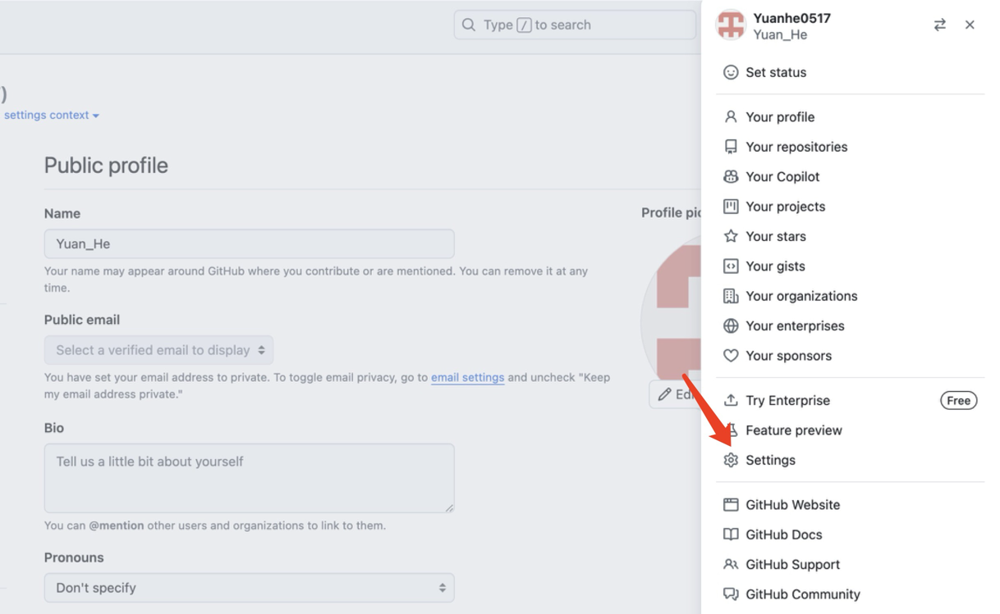
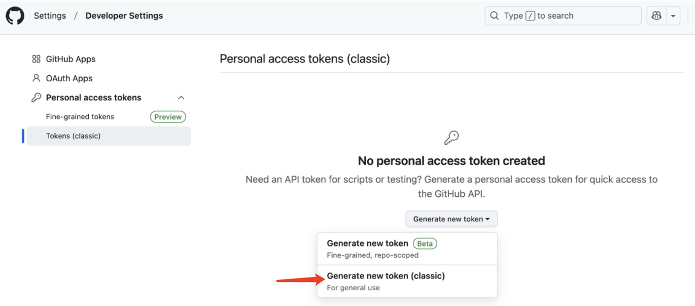
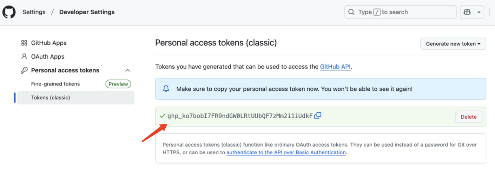
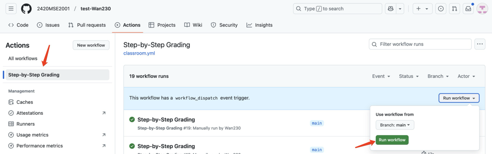
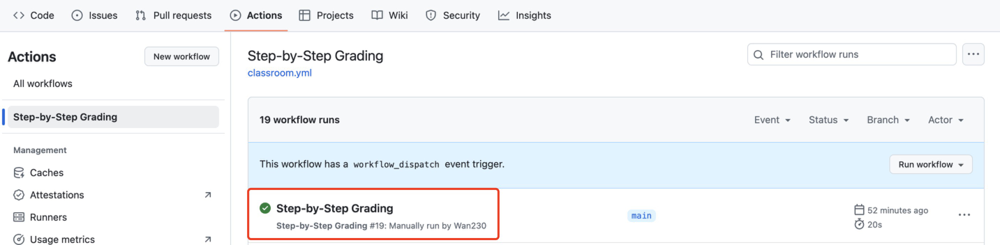

# Assignment-0220
---
## 如何开始：以Problem1 为例
1. **克隆仓库**
   ```bash

   git clone https://github.com/your-classroom/assignment.git

   cd assignment/problem1

   ```

2. **编写代码**
   - 在 `main.py` 中实现 `calculate_sum()` 函数

   - 通过标准输入获取数据

3. **将本地文件推送到GitHub仓库**

   ```bash

   git add main.py

   git commit -m "完成题目"

    ```
   
   接下来将本地文件重载到线上仓库，这一步我们需要通过**密钥**来进行身份验证：

   根据以下步骤获得
   
   
   
   
   
   
   **复制这段密钥，！！注意要及时保存！！**
   
   接着在原命令行输入
   ```
   git push 
   ```
   
   输入你的github帐号名与密钥即可

5. **回到仓库，在仓库的 **Actions** 标签页确认测试通过**
   
   

   

   

   当显示绿色标点时即为提交成功！


